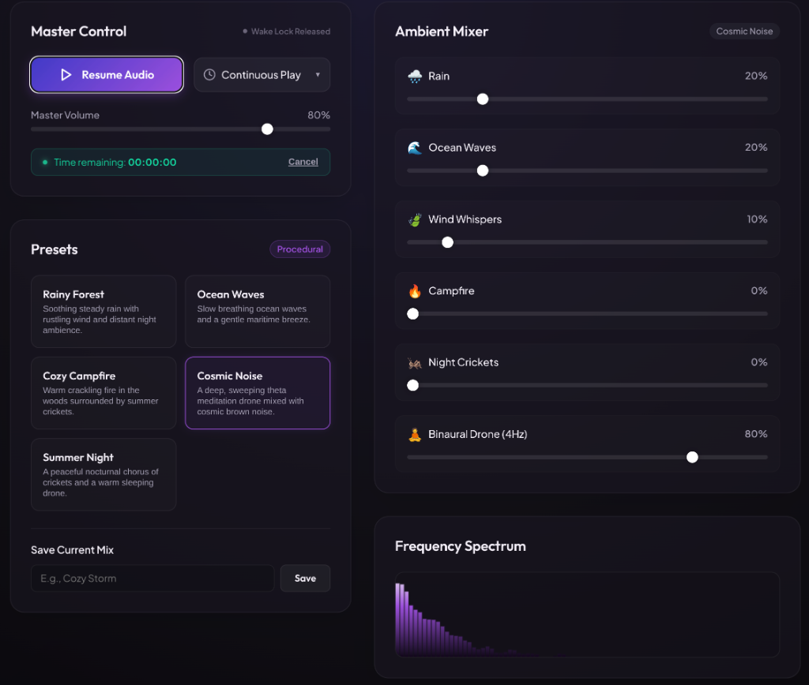

# Somnia: OLED Ambient Sound Synthesizer



Somnia is a premium, self-contained single-page web application that serves as an ambient sleep sound generator. It is designed to be highly optimized for OLED displays, with special features to keep the screen active while turning off pixels.

## 🌙 Key Features

- **Procedural Sound Synthesis (Web Audio API)**: All audio is generated in real-time on your computer. No audio assets are downloaded, keeping the app lightweight, responsive, and fully offline-capable.
  - *Rain*: Pink noise through a lowpass filter combined with randomized high-frequency raindrop impulses.
  - *Ocean Waves*: Modulating lowpass filtered brown noise swept dynamically by a low-frequency oscillator (LFO).
  - *Wind*: Pink noise passed through a whistling bandpass filter swept by organic, non-periodic dual LFOs.
  - *Campfire*: Low-frequency brown noise rumble coupled with high-passed white noise crackling bursts.
  - *Night Crickets*: Synthesized cricket trills created using detuned high-frequency carriers modulated in patterns.
  - *Binaural Drone*: Warm multi-oscillator G-chord with a 4Hz binaural difference (Theta state) panned left and right.
- **OLED-Optimized Sleep Mode**: Click "Enter Sleep Mode" to go fullscreen with a `#000000` (pure black) overlay. On OLED displays, this turns the pixels off completely to eliminate light emissions.
- **Screen Wake Lock API**: Actively requests browser wake locks to prevent your operating system or monitor from going to sleep while playing sounds.
- **Mouse Pointer Hiding**: Hides the mouse pointer automatically during sleep mode. Moving the mouse past a 30px threshold or pressing any key restores the control dashboard.
- **Preset Morphing**: Smoothly interpolates channel volumes and UI sliders over 2 seconds when switching presets.
- **Custom Mixes**: Save your custom mixer configurations as personalized presets (stored in `localStorage`).
- **Forced Stereo Output**: Configured with a forced stereo output mode to prevent silent playback or channel mapping issues when connected to 7.1/5.1 surround sound receivers (e.g., HDMI streams on Linux).

---

## 🛠️ Technology Stack

- **Framework**: [Vite](https://vite.dev/)
- **Language**: [TypeScript](https://www.typescriptlang.org/)
- **Styles**: Vanilla CSS (Neon glassmorphic cards, custom ranges, responsive layout)
- **Audio Core**: Web Audio API (procedural nodes, dynamic compressors)

---

## 🚀 Getting Started

### Prerequisites

You need [Node.js](https://nodejs.org/) and `npm` installed.

### Installation

1. Clone the repository:
   ```bash
   git clone https://github.com/mgantlett/oled-sleep-sounds.git
   cd oled-sleep-sounds
   ```

2. Install dependencies:
   ```bash
   npm install
   ```

3. Run the development server:
   ```bash
   npm run dev
   ```

4. Open your browser and navigate to the local URL (usually `http://localhost:5173`).

---

## 📄 License

This project is open source and available under the [MIT License](LICENSE).
